# Kubernetes-Auditor
Utilizing Azure Monitor capabilities to raise alerts based on specific Kubernetes audit logs

## Overview 

In highly regulated deployments of AKS clusters, you might want to keep close eye on audit logs.

AKS diagnostic logs have many categories which can help in answering questions like:

- What happened?
- When did it happen?
- Who initiated it?
- On what did it happen?
- Where was it observed?
- From where was it initiated?
- To where was it going?

In this repo, I explore how we can leverage AKS diagnostic settings along with Azure Monitor to setup alerts that are pushed to different channels to keep close eye on Kubernetes API calls.

## Understand AKS logs

In order to optimize your diagnostics logs configuration, these are the available sources:

| Category                | Description |
|:---|:---|
| cluster-autoscaler       | Understand why the AKS cluster is scaling up or down, which may not be expected. This information is also useful to correlate time intervals where something interesting may have happened in the cluster. |
| guard                   | Managed Azure Active Directory and Azure RBAC audits. For managed Azure AD, this includes token in and user info out. For Azure RBAC, this includes access reviews in and out. |
| kube-apiserver          | Logs from the API server. |
| kube-audit              | Audit log data for every audit event including get, list, create, update, delete, patch, and post. |
| kube-audit-admin        | Subset of the kube-audit log category. Significantly reduces the number of logs by excluding the get and list audit events from the log. |
| kube-controller-manager | Gain deeper visibility of issues that may arise between Kubernetes and the Azure control plane. A typical example is the AKS cluster having a lack of permissions to interact with Azure. |
| kube-scheduler          | Logs from the scheduler. |
| AllMetrics              | Includes all platform metrics. Sends these values to Log Analytics workspace where it can be evaluated with other data using log queries. |

You can check further documentation in [AKS Monitoring Reference](https://docs.microsoft.com/en-us/azure/aks/monitor-aks-reference)

## AKS diagnostic settings

Using Azure Portal under AKS -> Monitoring -> Diagnostic settings you will find the configuration you can setup to allow the collection of many diagnostic data.


Here I will be interested in **kube-audit-admin** to monitor specific actions on particular deployment which let's say is critical to my AKS cluster operational health.

### View the diagnostic logs

In order to create alerts, we need a good understanding of the logs.

Below are few queries that you can leverage to get started:

```kusto

// View all captured kube-audit-admin logs
AzureDiagnostics 
| where Category == "kube-audit-admin"

//View logs specific to particular deployment and verbs:
AzureDiagnostics 
| where Resource == "AKS-WEU"
| where Category == "kube-audit-admin"
| where log_s has "CUSTOM_WORKLOAD_NAME"
| where log_s has_any ("\"verb\":\"patch\"",  "\"verb\":\"delete\"" )
| where TimeGenerated > datetime(2022-05-19T09:32:52Z) and TimeGenerated < datetime(2022-05-19T09:37:52Z)

```

Play with the time ranges and different where cluases to optimize the query that you need.

### Selecting alert query(s)

After looking at the logs, you should already defined one or more specific queries that you want to be alerted on.

Just for demonstration, I will monitor the ```coredns``` related events for only the ```create``` verb.

```kusto

AzureDiagnostics 
| where Category == "kube-audit-admin"
| where log_s has "coredns"
| where log_s has_any ("\"verb\":\"create\"")

```

Notice that the above query do not filter on Resource Id like the sample before.

This is to allow me to receive logs from different AKS clusters connected to the same log analytics workspace (but I will separate the alerts based on the cluster resource id).

## Azure alert rule provisioning

In Azure Portal, search for Alerts to go the central alerts dashboard.

From there, you will see option to created new alert rule:

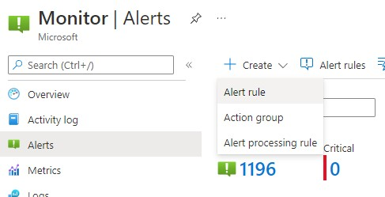

First thing we need to select is the scope, here I will select a specific log analytics workspace that I configured my AKS cluster diagnostic settings with:


Moving the the condition, we need to define the signal first, which will be log custom search:


Now I'm ready to define my conditions related to this alert rule:


Notice in the above screenshot, I have configured the following:

- Log query: based on the selected query on the previous steps
- Measurement: will be based on table rows counted every 5 mins
- Dimensioning: here I'm splitting the results based on Resource Id, which in this case will be the AKS cluster and any future clusters connected.
- For the alert logic, I'm firing the alert every 5 mins if the query returned more than 0 rows

Next, I would skip actions as it will be updated later and head to details tab:


Note here you just need to adjust these values based on you preference.

Now just enter any needed resource tags and create the alert.

Back at the Alerts view in Azure Portal, open the **Alert Rules** to view the newly created rule:

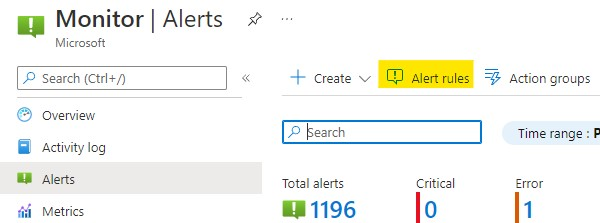

>NOTE: It might take couple of mins for the alert rule to be visible in table of alerts.

After 5 mins+-, you should see new alert was raised for the rule that we just created:

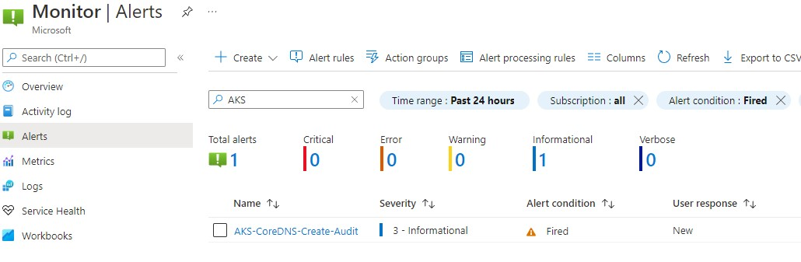

All good here so far.

## Logic App notifier

The scenario I'm after here is to built a logic app that will be used as an action to the alert to post a **Microsoft Teams** message when the alert is fired.

The benefit of using Logic Apps here is the graphical designer, amazing amount of built-in connectors and sufficient workflow and data control components that can allow sophisticated and tailored notification experience.

>NOTE: Although I'm using Microsoft Teams to post alert messages, you still can easily replace it with other connected systems.

Before going into the details, below is the final logic app design:

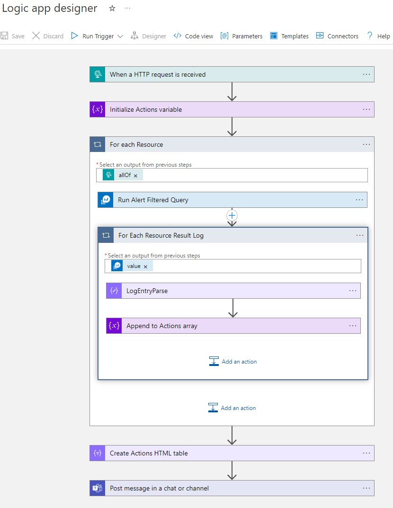

### Flow overview

- Trigger: Logic app will be trigger based http post (posting will be initiated by Azure Alert)
- Initialize results variable: to save the detected audit events to an array so it can be posted to a single message at the end
- Executing Outer loop: Looping trough each record of 'allOf' part of the payload which each represent a an alert query result
    - For each item, a query against Log Analytics workspace using the alert execution window to get the actual logs from the workspace (alerts no longer include the query results)
    - Executing inner loop: to read the actual logs:
        - Parsing Kubernetes Event: so the actual raw event will be saved in ```log_s``` field, so I'm parsing it to create output vairables to be used in the next step
        - Reading the parsed fields from ```log_s``` and saved it as json object in the ```Actions``` array (include the time, user, url and verb).
- Creating HTML Table: putting the Actions array into an HTML table for better presentation 
- Posting to teams: a message stating the number of detected actions and a table of them (time, user, url and verb).

Now let's construct the flow:

### Creating new logic app

Simply create a new logic app based on **Consumption** tier which will be sufficient for the needed scenario.

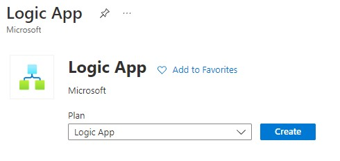

This is the settings I went with:

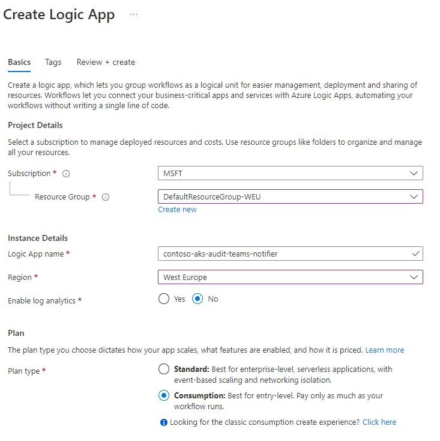

In a few seconds, the new logic app will be provisioned.

Select **When a HTTP request is received** option from the common triggers:

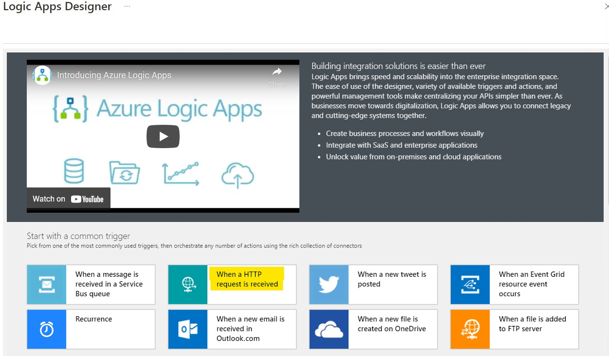

In the http designer, select **Use sample payload to generate schema**:

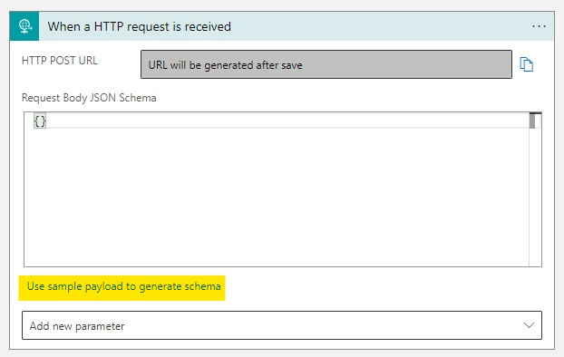

Copy and past content from [log-alerts-v2-schema.json](./log-alerts-v2-schema.json) as a sample schema.

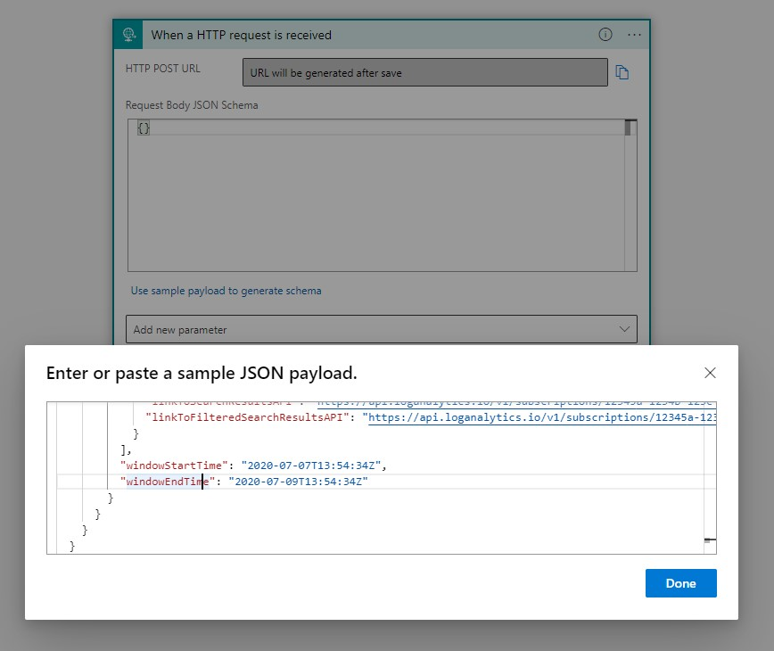

Click the **+ New step** button to add Variables - Initialize Variable action:

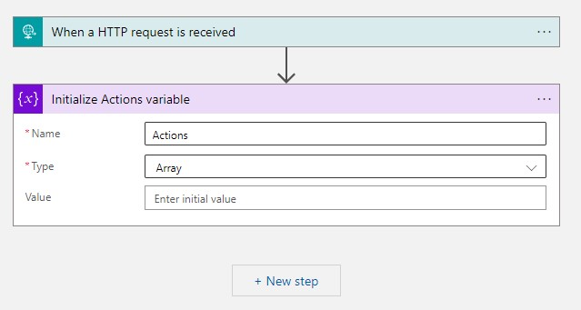

Create a new Control - For each action as our outer loop to go through the allOf array of the received http payload:

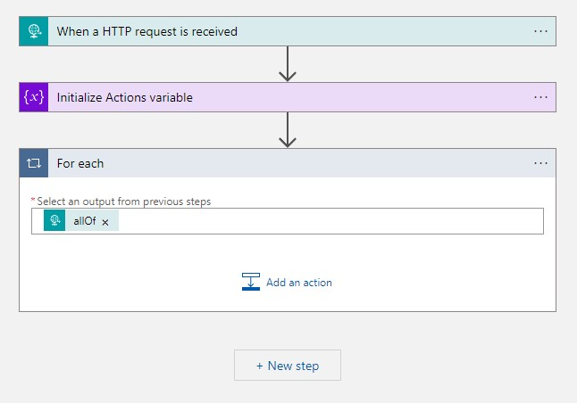

It is now time to retrieve the actual results from Log workspace through Azure Monitor Logs - Run query and list results action:

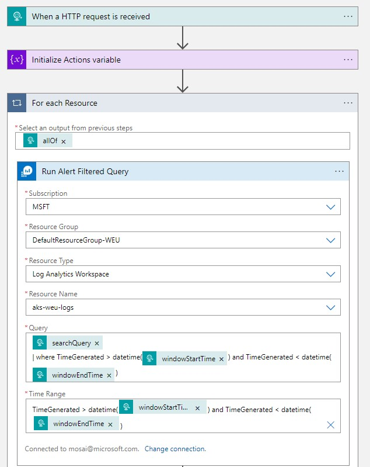